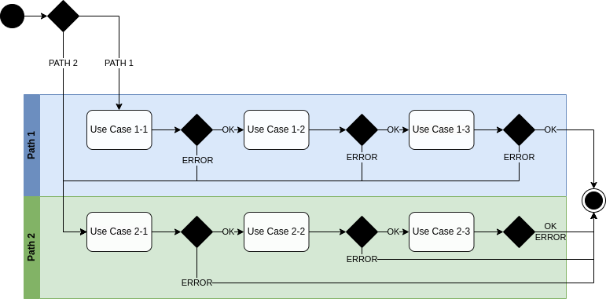

= Asynchronous Event-driven Workflows with Jakarta EE

[abstract]
This repository is an example for asynchronous event-driven workflows with Jakarta EE. It demonstrates how to use JMS and EJB Message-Driven Bean in Jakarta EE to create a simple asynchronous event-driven workflow.


= System Requirements

The application this project produces is designed to be run on Wildfly Application Server 32 or later.

All you need to build this project is Java 17 (Java SDK 17) and Maven 3.9.5 or later.

= Example Workflow

The example workflow consists of 6 different actions. There are 2 different entry points, and the workflow can be started from either of them. The workflow is as follows:




= Build and run the example

1. Open a command line and navigate to the root directory of this project.

2. Type this command to build and deploy the archive:

   ```shell
   mvn clean package -P provisioned-server
   ```

3. This will build a WAR file, download and provision a Wildfly server, and deploy the WAR file to the server (the fully configured server can be found in the `target/server` directory).

4. Run the following command to start the server:

   ```shell
   mvn wildfly:start
   ```

5. Launch the demo-frontend at <http://localhost:8080>.

6. Run the following command to stop the server:

   ```shell
    mvn wildfly:shutdown
    ```

